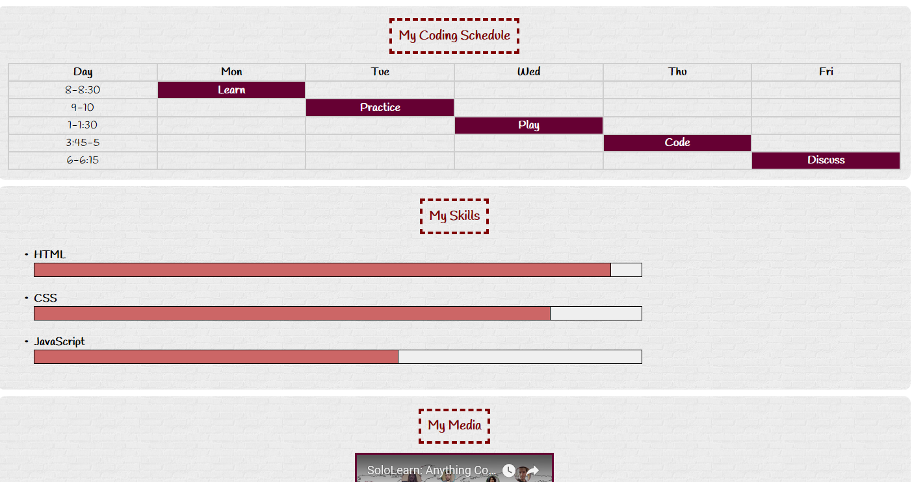

# Project Name
> PlanKodowania.com

## Table of contents
* [General info](#general-info)
* [Screenshots](#screenshots)
* [Technologies](#technologies)
* [Setup](#setup)
* [Features](#features)
* [Status](#status)
* [Inspiration](#inspiration)
* [Contact](#contact)

## General info
Blog in the form of a student's computer card with forms, tabel, fontello fonts and Subtle Patterns usage.

## Screenshots

## Technologies
* HTML5
* CSS3

## Setup
You can open this project using a web browser.

## Code Examples

	   '

            <svg class="face" height="100" width="100">
                <circle cx="50" cy="50" r="50" fill="#CC6666"/>
                <circle cx="30" cy="30" r="10" fill="#FFFFFF"/>
                <circle cx="70" cy="30" r="10" fill="#FFFFFF"/>
                <circle cx="30" cy="30" r="5" fill="#000000"/>
                <circle cx="70" cy="30" r="5" fill="#000000"/>
                <path d="M 30 70 q 20 20 40 0" stroke="#FFFFFF" stroke-width="5" fill="none" />
            </svg>
                 
            <form>
                <input name="name" placeholder="Name" type="text" required /> 
                <input name="email" placeholder="Email" type="email" required /> 
                <textarea name="message" placeholder="Message" required ></textarea>
                <input type="submit" value="SEND" class="submit" />
            </form>
            
'

## Features
List of features ready and TODOs for future development
* use of subtle Patterns
* using form and tabel
 * using fontello fonts

## Status
Project is: _finished

## Inspiration
Project inspired by SoloLearn HTML course.

## Contact
Created by [@Webmasterka](https://github.com/webmasterka) - feel free to contact me!
